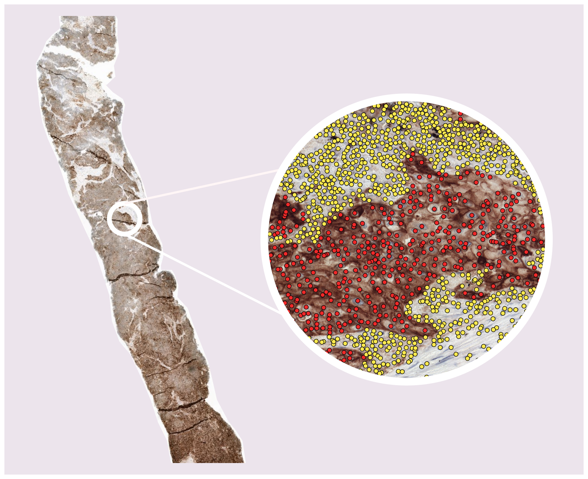
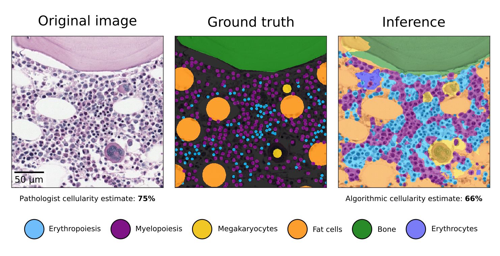

# Hi, I'm  Leander 👋

**AI Scientist · Medical Image Analysis · Research Software Engineer**

I enjoy building and deploying deep learning models for (bio)medical applications — from research prototype to clinical practice. My PhD research focused on predicting immunotherapy outcomes in lung cancer patients using computational pathology. After my PhD, I was a research software engineer implementing AI in the clinical practice of the Radboud University Medical Center in the Netherlands. 

**From March 2026, I am looking for a new job as an AI scientist/engineer or research software engineer.**

## 🔬 Research Highlights

### PD-L1 Cell Detection in Non-Small Cell Lung Cancer

Developed a deep learning pipeline to quantify PD-L1 expression at the cell level in whole-slide histopathology images, a key biomarker for immunotherapy eligibility.

---

### Open Histopathology Dataset for Detection & Segmentation

Co-created a publicly available H&E and PD-L1 annotated dataset for training and benchmarking AI models in computational pathology.

---

### Cellularity Quantification in Bone Marrow Biopsies
  
Built a segmentation model for automated quantification of cellularity in bone marrow histology to measure how cellularity varies throughout life.

## 🛠️ Skills

**AI & Machine Learning**  

**Infrastructure & Deployment**  

**Practices**  

---

## 🏢 Experience

| Period | Role | Organisation |
|---|---|---|
| 2025 – 2026 | Research Software Engineer | Radboudumc, Dept. of Pathology |
| 2021 – 2025 | PhD Researcher, Medical Image Analysis | Radboudumc, Computational Pathology |
| 2020 – 2021 | AI Research Intern | Polytechnique Montréal |
